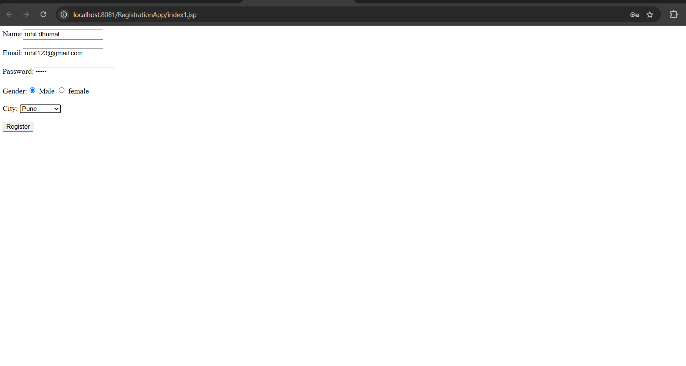
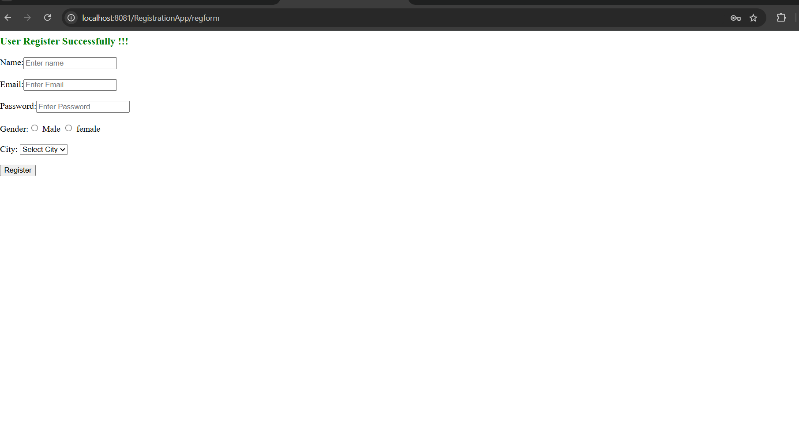
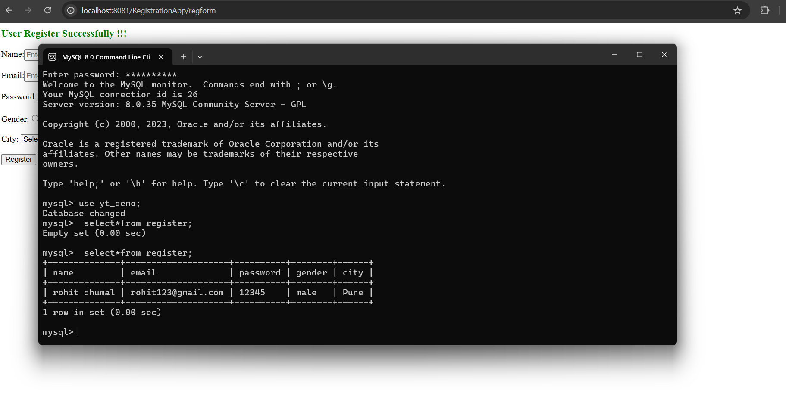

# Registration-App
Registration WebApp using Servlet and JSP

# Registration App - Dynamic Web Project



## 🌟 Overview

The **Registration App** is a dynamic web application built using **Servlets** and **JSP**. It provides a user-friendly interface to register users with details such as Name, Email, Password, Gender, and City. This project demonstrates the integration of servlets with JSP for handling user inputs and storing them in a database.

---

## 🚀 Features

- **Dynamic Form Submission**: Users can fill out the registration form and submit their details.
- **Database Integration**: All user information is stored securely in a MySQL database.
- **Validation and Feedback**: Provides real-time feedback on successful or unsuccessful registrations.
- **Simplified Interface**: Clean and easy-to-navigate user interface.
- **Cross-Browser Compatibility**: Runs seamlessly on major browsers.

---

## 📁 Project Structure

```
├── src/main/java/example/com/register.java  # Servlet for handling registration logic
├── WebContent/index1.jsp                   # JSP page for user interface
├── servletcontent.png                      # Screenshot of servlet content
├── SuccessfullRegistration.png             # Screenshot of successful registration
├── databaseContent.png                     # Screenshot of database content
```

---

## 🌐 Screenshots

### ✅ Successful Registration


### 🗄️ Database Content


---

## 🔧 Installation

1. Clone the repository to your local machine:

   ```bash
   git clone https://github.com/yourusername/registration-app.git
   ```

2. Set up your MySQL database:
   - Create a database named `yt_demo`.
   - Create a table named `register` with the following structure:
     ```sql
     CREATE TABLE register (
         name VARCHAR(100),
         email VARCHAR(100),
         password VARCHAR(100),
         gender VARCHAR(10),
         city VARCHAR(50)
     );
     ```

3. Update the database connection in `register.java`:

   ```java
   Connection con = DriverManager.getConnection("jdbc:mysql://localhost:3306/yt_demo","root","yourpassword");
   ```

4. Deploy the project to your favorite server (e.g., Apache Tomcat).

5. Access the application in your browser at:

   ```
   http://localhost:8080/registration-app/index1.jsp
   ```

---

## 📚 How to Use

1. Fill out the registration form with your details.
2. Click on the **Register** button.
3. Check the feedback message for successful registration or error details.
4. Verify the data in the database for confirmation.

---

## 🛠️ Technologies Used

- **Java Servlets**
- **JSP (Java Server Pages)**
- **MySQL Database**
- **Apache Tomcat Server**
- **HTML & CSS**

---

## 🌟 Future Enhancements

- Add client-side form validations.
- Implement session management for user login.
- Introduce email verification upon registration.
- Enhance the UI/UX with modern frameworks like Bootstrap or Tailwind CSS.

---

## 🤝 Contributions

Contributions are welcome! If you'd like to contribute, fork the repository, make your changes, and submit a pull request.

---

## 📄 License

This project is licensed under the [MIT License](LICENSE).

---

### ❤️ Thank You for Checking Out the Registration App!


